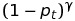
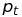
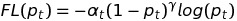

### Reasons for data preparation 
1. When using U-net for segmentation, we need to make sure the input image has the same size as the required input of the model. Therefore, it requires we resize the images.
2. As most of the convolutional network, one side effect of using pulling layer is that it lose some spatial resolutions. Although U-net has skip connection to reserve some features in the higher resoltuion. In practice, we still find some resolution loss. Therefore, here, I upsampling the data before the image segmentation.
3. I don't want to strech the image when we resizing it. Therefore, I first pad zero to the image to make the image size (column and row) = 2^n. 
### Training pipeline
1. use mouse to draw labels on images for training
2. prepare the label data to correct size (same as prediciton procedure)
3. data augmentation to increase training data
4. define and train the model
### Prediction pipeline
Pad zero to the image making column and row = 2^n

Slice the image to 2^m smaller pieces, which will be upsampled to the size of the network in data generator before feeding to the network

Stitch small patches to recover the original image, this will be used for the prediction results (segmented images)

Note: the first two steps are also required for the training data 

The model.py and data.py comes from  https://github.com/zhixuhao/unet, which already has a great implementation of the original u-net architecture in keras.

### Focal loss 
I also present a customerised loss function called focal loss. It was invented by [Lin, P Goyal, R Girshick, K He and P Dollar back in 2017 for Dense Object Detection.](https://arxiv.org/abs/1708.02002)

This paper proposed a new loss funciton for dense objection detection. Its aim is to increase the one stage detector's accuracy so that it can match with the two stage detector methods while maintaing the advantage in speed. The new cost function is a dynamic scaled cross entropy with modulation based on prediction confident. It emphasize the loss for low probability and reduce the influence of high confident prediction in the total loss, forcing the network to learn form the weak prediciton. 

The implementation is straight forward, by adding a modulating facotor , in the cross entropy equation before the summation. If  > 0.5, then this term will make its loss contribution smaller, and vice versa. They also proposed to keep , which is the weighting factor for balanced cross entropy. So the final focal loss function is 
Their proposed improvement is mainly based on the new loss function but not the archetecture themselves. Their RetianNet is based on two well known and well function articheture, the ResNet and FPN. The impact of this articles is that the proposed loss funciton can also be used in any other classification task. 

I tested the focal loss in this image segmentation problem. When comparing the two notebook, you can see that as the two classes are not balanced, with the focal loss, the prediction confidence of the minority class is improved by an order of maginitute 3. This is thanks to the fact that by using focal loss, we forced the network to train on the more difficult areas of the images. 

The authors also mentioned a few other types of methods for inbalanced classes: Hinge loss, weighted loss based on class distribution, Non-max suppresion and fixed background forground ratio in the two-stage detector. 

Non-max suppresion and hinge loss both discard completely of data over a certain threshold but the focal loss still keep this informatin for later training. This could be reason why focal loss with the RetinaNet has superior performance compared to previous methods. 

However, due to the added power law weight based on class probability, it can be unstable. Therefore, it needs to use sigmoid instead of ReLu in the RetinaNet, also it need to add alpha, and using prior for model initialization to damping down the effect of the power law term. However, because alpha is on top of the power law term, the impact and the range of an ideal alpha are small. Although the author pointed out that the exact form of the focal loss doesn't matter. I think eventhough it doesn't change the average accuracy, but a more modest term will imporve the stability. I will suggest to add a linear term to damping down the effect, in other words, use 
 instead.
